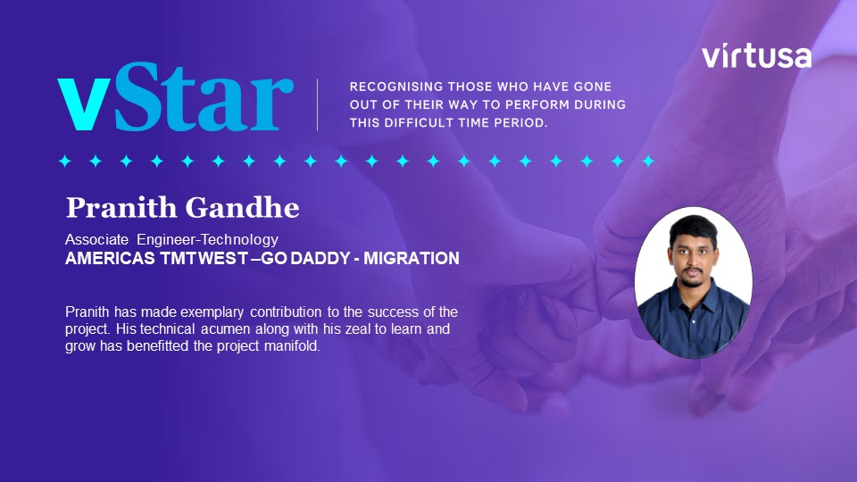
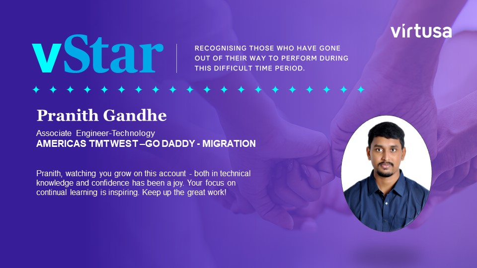
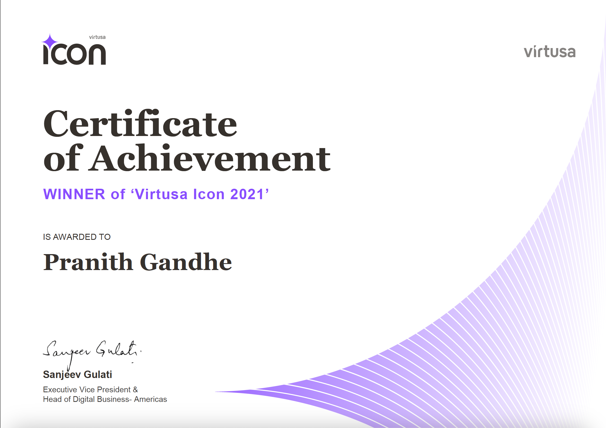

# Data Engineer

<!-- ******************************************************************************************************************** -->

<!-- ******************************************************************************************************************** -->

### Professional Summary
3+ years of experience as a Data Engineer proficient in Big Data migration and AWS cloud solutions. Skilled in Python, SQL, and AWS services with a proven ability to optimize workflows and system performance. Committed to driving efficiency and delivering impactful solutions in data management for business success.

<!-- ******************************************************************************************************************** -->

### Education
- M.S., Advanced Data Analytics | University of North Texas (May 2024)
- B.Tech., Information Technology | JNTU (September 2020)

<!-- ******************************************************************************************************************** -->

### Work Experience
<b> Data Engineer @ Virtusa Consulting Services Private LTD, Client: <I>GoDaddy</I> </b>
-	Redesigned architecture framework for Big Data to AWS migration, reducing the team efforts and reducing overall workload by 30%.
-	Coordinated the development and deployment of AWS-based big data solutions, overseeing a 100TB Hadoop cluster and a Hive data warehouse with 100 million rows of data.
-	Introduced conversion of on-prem Oozie DAGs to Managed Apache Airflow DAGs, streamlining the workflow efficiency by 25%.
-	Engineered a migration factory setup in the AWS cloud environment, resulting in a 20% decrease in deployment time.
-	Played a key role in the successful migration of Big Data architecture to AWS, leveraging Hadoop, Spark, Hive, and EMR technologies to optimize data processing and analysis capabilities.
-	Identified  and resolved application performance issues, leading to a 15% improvement  in system performance and EMR cluster optimization.
-	Maintained up-to-date documentation and provided training to end-users on new systems and processes, ensuring smooth transition and adoption of new technologies.
-	EMR, S3, EC2, Lambda, Glue, Athena, Lake formation, Kinesis, Redshift, Hadoop, Spark, Hive, HDFS, Airflow, RDS, GIT, ETL.

<b>Associate Software Engineer @ Virtusa Consulting Services Private LTD, Client: <I>GoDaddy</I> </b>
- Developed automation scripts for file segregation and upload process, saving up to 10 hours weekly.
- Created external and internal hive tables with appropriate static and dynamic partitions.
- Developed an automation Code that pulls the files from

<b>Engineer @ L&T Technology Services (LTTS) LTD</b>
- Developed a project addressing communication challenges for non-verbal individuals in the era of autonomous vehicles, enabling interaction through facial movements.
- Employed DLIB library for face and facial landmark detection, integrating Python's flexibility for an interactive experience.
- Utilized OpenCV and machine learning techniques to analyze lip movement, allowing users to communicate effectively by carrying the device in their daily activities.

<!-- ******************************************************************************************************************** -->

### Projects
<b>Data Fabric Modernization </b> – <I>Virtusa Consulting Services Private LTD</I>
-	Data is captured from multiple sources with ingestion into a Kinesis Data Stream.
-	The ETL process is executed through Kinesis Data Firehose for seamless data transformation.
-	Used lambda for transformation and sending the data to various storage services which reduced 40% deployment time.

<b>Border Crossing Analysis and Visualization</b> – <I>University of North Texas</I>
-	Implemented a data pipeline with AWS services such as S3, Athena, and EMR for efficient data storage and analysis.
-	Redesigned the schema for enhancements for in-depth analysis. Utilized Hadoop MapReduce on EMR for extensive analysis to find out the number of passengers in each vehicle type which decreased 50% human effort.
-	Utilized Power BI to connect to S3 to develop insightful measures which resulted in a 30% improvement in data analysis and understanding.

### Career Achievements
- 2 times Star Performer of the Quater Award (Godaddy)

 | 

- Virtusa Icon Award

